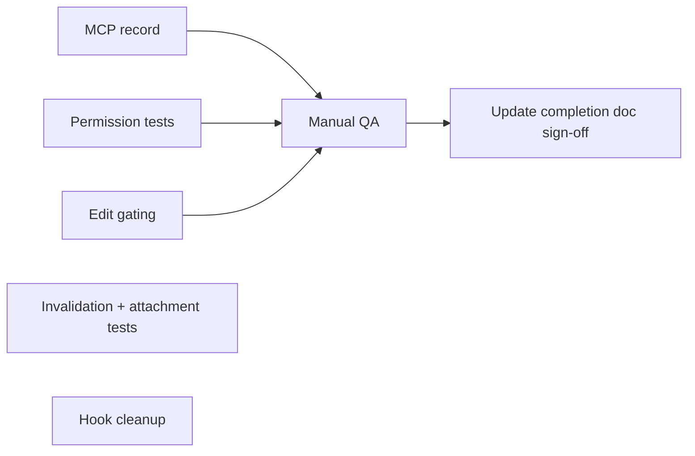

# SLICE-03 — Planning (logistics) — Remediation plan

**Authority:** [TR03-planning-logistics-requirements.md](../requirements/TR03-planning-logistics-requirements.md)  
**Completion record:** [TR03-slice-completion.md](./TR03-slice-completion.md)  
**Created:** 2026-05-20

Implementation meets TR03 in code and automated gates; the items below close documentation, test, UX, and sign-off gaps before treating SLICE-03 as fully signed off.

---

## Priority overview

| Priority | Item | Blocks sign-off? |
|----------|------|------------------|
| P0 | Manual dev-db verification checklist | Yes (product sign-off) |
| P1 | Record dev-db MCP schema / enum alignment | Yes (requirements prerequisite) |
| P2 | Permission integration test (scenario 3) | No (quality) |
| P2 | Gate list **Edit** on `usePageCan('planning', 'update')` | No (UX polish) |
| P3 | Invalidation unit test | No |
| P3 | Attachment error integration test | No |
| P3 | Responsive layout manual pass | No |
| P4 | Remove unused `uploadFile` path in attachments hook | No (cleanup) |
| — | Capacity utilisation hints | Deferred (optional per TR03) |

---

## P0 — Manual dev-db verification

**Goal:** Satisfy TR03 § Verification and completion record manual checklist.

**Steps:**

1. Configure `.env` for dev Supabase (not production).
2. Sign in as planner role with `read` + `create` + `update` + `delete` on page `planning`.
3. For each resource type (transport, accommodation, activity):
   - Create with enums, capacity, place pick, costs, attachment after save.
   - Edit row; confirm list shows snapshot fields, not live cache.
   - Delete row.
4. Sign in as participant without planning write: confirm Add hidden, Save disabled, RLS blocks direct API if attempted.
5. Sign in without `read:page.planning`: confirm shell `AccessDenied` on `/planning`.
6. Update `trac_location_cache` row externally (SQL); confirm logistics row address unchanged until re-save.
7. Tick boxes in [TR03-slice-completion.md](./TR03-slice-completion.md) § Manual verification.

**Owner:** Human QA / planner role on dev-db.

---

## P1 — Dev-db MCP validation record

**Goal:** Meet TR03 § Data and schema references — “Required before implementation: column lists, enums, RLS”.

**Steps:**

1. Use Supabase MCP against **dev-db** for:
   - `trac_transport`, `trac_accommodation`, `trac_activity` — columns used in [types.ts](../../src/features/planning/types.ts) / [build-payloads.ts](../../src/features/planning/build-payloads.ts)
   - Enum values for `trac_status`, `transport_mode` vs [enums.ts](../../src/features/planning/enums.ts)
   - RLS policies on logistics tables and `core_file_references`
   - `trac_location_cache` SELECT for authenticated, INSERT/upsert service_role only
2. Append a short **“Dev-db validation”** subsection to [TR03-slice-completion.md](./TR03-slice-completion.md) with date, MCP summary, and any enum drift fixes.

**If drift found:** Update `enums.ts` / payloads in same PR; re-run `npm run validate`.

---

## P2 — Permission test (TR03 testing #3)

**Goal:** Replace mock-only assertion with a rendered guard test.

**Approach:**

1. Add `TransportDialog.test.tsx` (or list test) with `vi.mock('@solvera/pace-core/rbac')` returning `{ can: false }` for `create`/`update`.
2. Assert **Save** `disabled` and **Add transport** not rendered when `canCreate` false.
3. Optionally assert `PagePermissionGuard` denial when read false (wrap `PlanningPage` without guard bypass).

**Files:** `src/features/planning/components/TransportDialog.test.tsx` (new).

**Acceptance:** TR03 testing row 3 marked **Complete** in completion doc.

---

## P2 — Hide Edit without update permission

**Goal:** Align list actions with AC6 (“cannot mutate”) without blocking read-only inspection if product wants view-only dialog later.

**Approach (recommended):**

- In `TransportList`, `AccommodationList`, `ActivityList`:
  - `const { can: canUpdate } = usePageCan('planning', 'update');`
  - Render **Edit** only when `canUpdate` (or `canCreate` when creating from list is separate).

**Alternative:** Keep Edit for read-only view; rename button to **View** when `!canUpdate`.

**Files:** Three list components under `src/features/planning/components/`.

---

## P3 — Invalidation unit test

**Goal:** Lock AC8 behaviour in CI.

**Approach:**

1. Test `invalidatePlanningAndDependents` with a mock `QueryClient` (`invalidateQueries` spy).
2. Assert calls include `planningQueryKeys.all`, per-resource keys for `eventId`, and `TRAC_ITINERARY_QUERY_PREFIX`, `TRAC_COSTS_QUERY_PREFIX`, `TRAC_DASHBOARD_QUERY_PREFIX`, `TRAC_MASTERPLAN_QUERY_PREFIX`.

**File:** `src/features/planning/invalidation.test.ts` (new).

---

## P3 — Attachment failure test

**Goal:** TR03 AC7 — explicit errors on storage/reference cleanup failures.

**Approach:**

1. Mock `usePlanningAttachments` or Supabase client to throw on delete/upload.
2. Render `PlanningAttachmentsSection` and assert destructive `Alert` text.

**File:** `PlanningAttachmentsSection.test.tsx` (new).

---

## P3 — Responsive layout pass

**Goal:** TR03 § Visual specification — mobile collapse.

**Approach:** Manual check at narrow viewport: tabs, dialogs, attachment list, place prediction list remain usable; file follow-up issue if pace-core dialog overflow.

---

## P4 — Attachments hook cleanup

**Goal:** Single upload path.

**Observation:** [usePlanningAttachments.ts](../../src/features/planning/hooks/usePlanningAttachments.ts) defines `uploadMutation` / `uploadFile` but UI uses pace-core `FileUpload` only.

**Approach:** Remove unused `uploadMutation` and `uploadFile` export, or delegate `FileUpload` `onUploadSuccess` through one documented path. Keep `removeAttachment` with explicit storage + DB delete.

---

## Deferred (not required for TR03)

| Item | Reason |
|------|--------|
| Capacity utilisation hints from assignments | TR03 optional; SLICE-04 |
| Server-side enum integration test | Covered by Postgres enums; optional E2E |
| `@solvera/pace-core/crud` helpers | `FileUpload` + secure client satisfy contract “where applicable” |

---

## Suggested execution order

1. P1 MCP record (can run in parallel with code fixes).  
2. P2 tests + Edit gating (small PR).  
3. P0 manual QA → tick checklist.  
4. P3/P4 as follow-up hardening PRs.

---

## Definition of done (SLICE-03 sign-off)

- [ ] All manual verification boxes checked in [TR03-slice-completion.md](./TR03-slice-completion.md)
- [ ] Dev-db validation subsection added (P1)
- [ ] TR03 testing row 3 **Complete** (P2)
- [ ] No open **P0/P1** items
- [ ] Build queue Evidence notes “signed off” or links to dated manual pass
